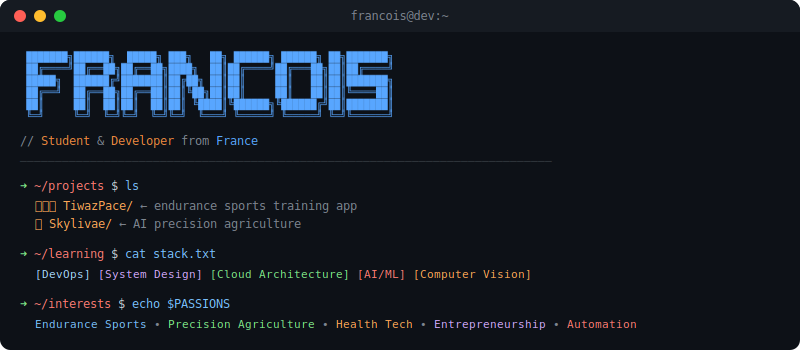

## 🔧 What I'm building

<table align="center">
<tr>
<td width="50%" valign="top">
<h3>🏊 🚴 🏃 TiwazPace</h3>
<b>Coming soon...</b>
  
Web app for planning and analyzing endurance sports training. Built for runners, cyclists, swimmer, and triathletes who want data-driven insights.
  
<code>Bun</code> <code>Next.js</code> <code>Redis + BullMQ</code> <code>HonoJS</code> <code>Docker</code> <code>Typescript</code> <code>PostgreSQL</code>
</td>
<td width="50%" valign="top">
<h3>🌻 Skylivae</h3>
<b>Long-term project</b>
  
AI-powered precision agriculture platform combining satellite imagery and machine learning. Helping farmers monitor crops, optimize resources, and make data-driven decisions.
  
<code>Bun</code> <code>Next.js</code> <code>HonoJS</code> <code>Docker</code> <code>Typescript</code> <code>ML/AI</code>
</td>
</tr>
</table>

 

## ⚙️ Tech Stack

 

 

 

## 🔋 Activity Graph

